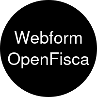

<p align="center">
  <a href="" rel="noopener">
  </a>
</p>

<h1 align="center">This module integrates Drupal Webform functionality with the OpenFisca API,
allowing for seamless communication and calculation based on OpenFisca rules.
</h1>

<div align="center">

[](https://github.com/salsadigitalauorg/webform_openfisca/issues)
[](https://github.com/salsadigitalauorg/webform_openfisca/pulls)
[](https://github.com/salsadigitalauorg/webform_openfisca/actions/workflows/test.yml)


[](https://codecov.io/github/salsadigitalauorg/webform_openfisca)


</div>

---

## Features

- Handles communication with the OpenFisca API through Guzzle HTTP client.
- Provides methods to post data, retrieve variables, parameters,
  and calculations from the OpenFisca API.
- Webform handler for processing submissions & interacting with OpenFisca API.
- Provides a mechanism for creating redirect rules
  based on OpenFisca responses.

## Installation

1. Install the module as you would any other Drupal module.

## Usage

1. Ensure the OpenFisca API configuration is correctly set
in the Drupal configuration.
2. Configure Webform fields to map to OpenFisca variables
and set any specific rules.
3. Submit a Webform, and the module will communicate with OpenFisca API,
perform calculations, and handle redirects based on configured rules.

## Configuration

### Webform Fields Configuration

- Map Webform fields to OpenFisca variables through the Webform UI.
- Configure the OpenFisca API endpoint and other settings.

### Redirect Rules Configuration

- Define redirect rules in Drupal content type "rac" associated with Webforms.
- Rules are evaluated based on OpenFisca calculation results,
and matching rules trigger redirects.

## Local development

1. Install PHP with SQLite support and Composer
3. Clone this repository
4. Run `ahoy build`

## Building website

`ahoy build` assembles the codebase, starts the PHP server
and provisions the Drupal website with this extension enabled. These operations
are executed using scripts within [`.devtools`](.devtools) directory. CI uses
the same scripts to build and test this extension.

The resulting codebase is then placed in the `build` directory. The extension
files are symlinked into the Drupal site structure.

The `build` command is a wrapper for more granular commands:
```bash
ahoy assemble     # Assemble the codebase
ahoy start        # Start the PHP server
ahoy provision    # Provision the Drupal website
```

The `provision` command is useful for re-installing the Drupal website without
re-assembling the codebase.

### Drupal versions

The Drupal version used for the codebase assembly is determined by the
`DRUPAL_VERSION` variable and defaults to the latest stable version.

You can specify a different version by setting the `DRUPAL_VERSION` environment
variable before running the `ahoy build` command:

```bash
DRUPAL_VERSION=11 ahoy build        # Drupal 11
DRUPAL_VERSION=11@alpha ahoy build  # Drupal 11 alpha
DRUPAL_VERSION=10@beta ahoy build   # Drupal 10 beta
DRUPAL_VERSION=11.1 ahoy build      # Drupal 11.1
```

The `minimum-stability` setting in the `composer.json` file is
automatically adjusted to match the specified Drupal version's stability.

### Using Drupal project fork

If you want to use a custom fork of `drupal-composer/drupal-project`, set the
`DRUPAL_PROJECT_REPO` environment variable before running the `ahoy build`
command:

```bash
DRUPAL_PROJECT_REPO=https://github.com/me/drupal-project-fork.git ahoy build
```

### Patching dependencies

To apply patches to the dependencies, add a patch to the `patches` section of
`composer.json`. Local patches are be sourced from the `patches` directory.

### Providing `GITHUB_TOKEN`

To overcome GitHub API rate limits, you may provide a `GITHUB_TOKEN` environment
variable with a personal access token.

### Provisioning the website

The `provision` command installs the Drupal website from the `standard`
profile with the extension (and any `suggest`'ed extensions) enabled. The
profile can be changed by setting the `DRUPAL_PROFILE` environment variable.

The website will be available at http://localhost:8000. The hostname and port
can be changed by setting the `WEBSERVER_HOST` and `WEBSERVER_PORT` environment
variables.

An SQLite database is created in `/tmp/site_webform_openfisca.sqlite` file.
You can browse the contents of the created SQLite database using
[DB Browser for SQLite](https://sqlitebrowser.org/).

A one-time login link will be printed to the console.

## Coding standards

The `ahoy lint` command checks the codebase using multiple
tools:
- PHP code standards checking against `Drupal` and `DrupalPractice` standards.
- PHP code static analysis with PHPStan.
- PHP deprecated code analysis and auto-fixing with Drupal Rector.
- PHP code mess detection with PHPMD.
- Twig code analysis with Twig CS Fixer.

The configuration files for these tools are located in the root of the codebase.

### Fixing coding standards issues

To fix coding standards issues automatically, run the `ahoy lint-fix`. This
runs the same tools as `lint` command but with the`--fix` option (for the
tools that support it).

## Testing

The `ahoy test` command runs the PHPUnit tests for this extension.

The tests are located in the `tests/src` directory. The `phpunit.xml` file
configures PHPUnit to run the tests. It uses Drupal core's bootstrap file
`core/tests/bootstrap.php` to bootstrap the Drupal environment before running
the tests.

The `test` command is a wrapper for multiple test commands:
```bash
ahoy test-unit        # Run Unit tests
ahoy test-kernel      # Run Kernel tests
ahoy test-functional  # Run Functional tests
```

### Running specific tests

You can run specific tests by passing a path to the test file or PHPUnit CLI
option (`--filter`, `--group`, etc.) to the `ahoy test` command:

```bash
ahoy test-unit tests/src/Unit/MyUnitTest.php
ahoy test-unit -- --group=wip
```

You may also run tests using the `phpunit` command directly:

```bash
cd build
php -d pcov.directory=.. vendor/bin/phpunit tests/src/Unit/MyUnitTest.php
php -d pcov.directory=.. vendor/bin/phpunit --group=wip
```

### Check code coverage
After running all tests, coverage reports are generated in the directory
`.logs/coverage/phpunit` in various formats.

You can run the command `ahoy check-code-coverage` to show the summary
of the coverage reports.

---
_This repository was created using the [Drupal Extension Scaffold](https://github.com/AlexSkrypnyk/drupal_extension_scaffold) project template_
